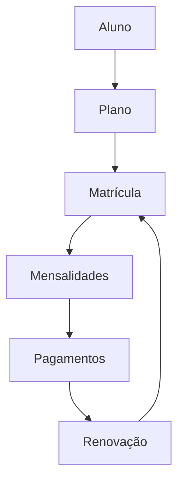
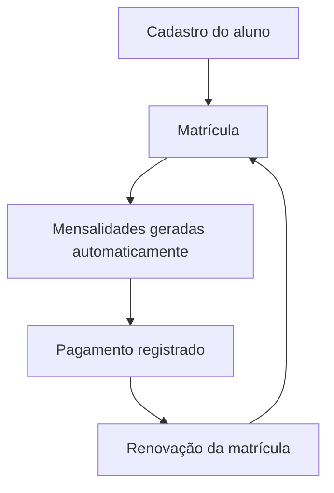
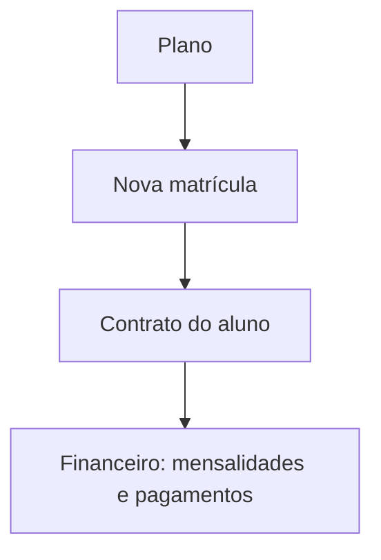

<!-- CAPA -->

MANUAL DO USUÁRIO

<h1 class="cover-title">SaaSGym</h1>

Sistema de Gestão para Academias

Versão 1.0 — Julho de 2026

## Sumário

1. [Introdução](#cap-1-introducao)
2. [Primeiro acesso](#cap-2-primeiro-acesso)
3. [Dashboard](#cap-3-dashboard)
4. [Cadastro de Alunos](#cap-4-cadastro-de-alunos)
5. [Planos](#cap-5-planos)
6. [Matrículas](#cap-6-matriculas)
7. [Financeiro](#cap-7-financeiro)
8. [Agenda](#cap-8-agenda)
9. [Professores](#cap-9-professores)
10. [Avaliações Físicas](#cap-10-avaliacoes-fisicas)
11. [Reposições](#cap-11-reposicoes)
12. [Notificações](#cap-12-notificacoes)
13. [Perfil](#cap-13-perfil)
14. [Perguntas Frequentes](#cap-14-perguntas-frequentes)
15. [Boas Práticas](#cap-15-boas-praticas)
16. [Glossário](#cap-16-glossario)
17. [Fluxos Visuais](#cap-17-fluxos-visuais)

## Capítulo 1 — Introdução {#cap-1-introducao}

### Objetivo

Apresentar o que é o SaaSGym, para que serve e como as informações se conectam dentro do sistema, para que qualquer pessoa da equipe — mesmo sem nunca ter usado um sistema de gestão — entenda a lógica geral antes de operar o dia a dia.

### Quando utilizar

Leia este capítulo antes de usar qualquer outra parte do sistema, principalmente se for a primeira vez que você acessa o SaaSGym.

### O que é o SaaSGym

O SaaSGym é o sistema onde a academia organiza tudo o que precisa para funcionar no dia a dia:

- Quem são os alunos e professores.
- Quais planos a academia vende.
- Quem está matriculado em qual plano.
- Quais mensalidades estão pendentes, pagas ou atrasadas.
- Quais aulas e turmas existem, e quem frequentou cada uma.
- A avaliação física de cada aluno ao longo do tempo.

Tudo fica registrado em um único lugar, acessível pelo navegador de internet, sem precisar instalar nada no computador.

### Como funciona

O SaaSGym é organizado em módulos (áreas), acessíveis pelo menu lateral esquerdo. Cada módulo cuida de uma parte do negócio: Alunos, Professores, Planos, Matrículas, Financeiro, Agenda, Relatórios. As informações conversam entre si — por exemplo, ao matricular um aluno em um plano, o sistema já organiza automaticamente as cobranças (mensalidades) referentes àquele contrato.

### Fluxo básico da academia

O ciclo de vida mais comum de um aluno dentro do sistema segue esta ordem:

Em palavras simples:

1. Primeiro, o aluno é cadastrado no sistema.
2. A academia já tem os planos cadastrados (mensal, trimestral, semestral, anual).
3. O aluno é matriculado em um desses planos — isso cria o contrato dele com a academia.
4. A matrícula gera automaticamente as mensalidades previstas para todo o período contratado.
5. Conforme o aluno paga, a recepção registra o pagamento de cada mensalidade.
6. Quando o contrato está perto do fim, a academia renova a matrícula, criando o próximo ciclo.

> 
<strong>Importante</strong>
> O SaaSGym nunca apaga informações de verdade. Cadastros "removidos" ficam inativos e preservados, e o histórico financeiro nunca é apagado — isso protege a academia em caso de dúvidas futuras (por exemplo, um aluno que reclama de uma cobrança de meses atrás).

### Observações importantes

- Este manual descreve exatamente o que existe no sistema hoje. Algumas telas mostram avisos de "Em breve" — são funcionalidades planejadas que ainda não estão disponíveis, e por isso não são descritas aqui como se já existissem.
- O sistema é multiusuário: várias pessoas da academia podem usar ao mesmo tempo, cada uma com seu próprio login.

### Erros comuns

- Achar que "cadastrar o aluno" já significa que ele está pagando algo. Cadastrar o aluno é só o primeiro passo — sem uma matrícula, não existe cobrança.
- Confundir Plano com Matrícula. O Plano é o "produto" que a academia vende (ex.: Mensal, R$ 150). A Matrícula é o contrato de um aluno específico com aquele plano.

### Dicas

- Sempre que tiver dúvida sobre um termo (Matrícula, Mensalidade, Vencimento etc.), consulte o [Capítulo 16 — Glossário](#cap-16-glossario).
- Leia o Capítulo 17 se preferir entender o fluxo através de diagramas visuais.

## Capítulo 2 — Primeiro acesso {#cap-2-primeiro-acesso}

### Objetivo

Ensinar como entrar no sistema pela primeira vez, trocar sua senha e sair com segurança.

### Quando utilizar

Sempre que for acessar o SaaSGym, especialmente no primeiro dia de uso.

### Passo a passo — Login

1. Abra o navegador de internet e acesse o endereço do SaaSGym fornecido pela sua academia.
2. Na tela inicial, preencha o campo **E-mail** com o e-mail cadastrado.
3. Preencha o campo **Senha**.
4. Clique em **Entrar**.

[Inserir captura da tela aqui]

> 
<strong>Atenção</strong>
> Se o e-mail ou a senha estiverem incorretos, o sistema mostra uma mensagem de erro e não deixa entrar. Confira se não há espaços extras ou letras maiúsculas/minúsculas trocadas no e-mail.

### Passo a passo — Troca de senha

1. Depois de logado, clique no seu nome/avatar (canto superior, dentro do menu lateral).
2. Selecione **Meu perfil**.
3. Na seção **Trocar senha**, preencha **Senha atual**, **Nova senha** e **Confirmar nova senha**.
4. Clique em **Trocar senha**.
5. O sistema mostra a mensagem "Senha alterada com sucesso. Faça login novamente." e leva você de volta à tela de login automaticamente.

[Inserir captura da tela aqui]

### Passo a passo — Perfil

1. Clique no seu nome/avatar e depois em **Meu perfil**.
2. Ali você pode trocar sua foto (ícone de câmera sobre o avatar) e editar seu **Nome**.
3. Clique em **Salvar** para confirmar a alteração do nome.

### Passo a passo — Sair do sistema

1. Clique no seu nome/avatar, no menu lateral.
2. Selecione **Sair**.

### Observações importantes

- A nova senha precisa ter no mínimo 8 caracteres.
- Ao trocar a senha, o sistema desconecta você automaticamente — isso é esperado, é uma medida de segurança. Basta entrar de novo com a senha nova.
- Não existe, atualmente, um botão de "esqueci minha senha" na tela de login. Se você esquecer a senha, peça para um administrador da academia trocá-la ou ajudá-lo.

### Erros comuns

- Tentar trocar a senha sem preencher a **Senha atual** corretamente — o sistema não deixa prosseguir.
- Digitar senhas diferentes em **Nova senha** e **Confirmar nova senha** — o sistema avisa "As senhas não coincidem".

### Dicas

- Nunca compartilhe sua senha com outra pessoa da equipe. Se mais alguém precisa acessar o sistema, peça para um administrador criar um usuário próprio para essa pessoa.
- Sempre clique em **Sair** ao final do expediente, principalmente em computadores compartilhados na recepção.

## Capítulo 3 — Dashboard {#cap-3-dashboard}

### Objetivo

Explicar como interpretar a tela inicial do sistema, que reúne os principais avisos e indicadores do dia a dia da academia.

### Quando utilizar

Todos os dias, ao abrir o sistema — é a primeira tela que aparece depois do login, pensada para mostrar rapidamente o que precisa da sua atenção.

### Passo a passo — Como interpretar

1. Ao entrar, você verá uma saudação ("Bom dia" / "Boa tarde" / "Boa noite") com o seu nome, seguida da frase "Aqui está o que precisa da sua atenção agora."
2. Percorra as seções de cima para baixo — elas já vêm organizadas por prioridade.

[Inserir captura da tela aqui]

### Seções do Dashboard

**Alertas financeiros** — mostra mensalidades vencidas e a vencer nos próximos dias. Um selo indica quantas estão "em atraso" ou se está "Em dia". Cada linha mostra se a mensalidade "Venceu em" ou "Vence em" determinada data. Se não houver nada pendente, aparece "Nenhuma mensalidade vencida ou a vencer".

**Agenda da semana** — lista as aulas dos próximos dias, com data ("Hoje", "Amanhã" ou o dia da semana) e status ("Agendada" ou "Cancelada"). Se não houver aulas, aparece "Nenhuma aula agendada essa semana".

**Navegação rápida** — atalhos para as telas mais usadas: Alunos, Matrículas, Mensalidades e Calendário.

**Alunos novos** — alunos cadastrados no mês atual. Se não houver nenhum, aparece "Nenhum aluno novo este mês".

**Aniversariantes** — alunos que fazem aniversário no mês atual (útil para ações de relacionamento).

**Indicadores** — cartões numéricos: Alunos ativos, Total de alunos, Professores, Usuários do sistema.

### Observações importantes

- O Dashboard é só leitura — para agir sobre qualquer item (registrar um pagamento, ver uma aula), use os botões de atalho ou vá até o módulo correspondente.
- Os números do Dashboard são atualizados toda vez que você entra ou recarrega a tela.

### Erros comuns

- Achar que o Dashboard mostra todo o histórico. Ele é pensado para o que é urgente/recente — dados completos e antigos ficam nos módulos específicos (Mensalidades, Relatórios etc.).

### Dicas

- Use os "Alertas financeiros" como sua lista diária de cobranças a fazer.
- Use "Aniversariantes" para lembrar a equipe de parabenizar os alunos — isso ajuda na retenção.

## Capítulo 4 — Cadastro de Alunos {#cap-4-cadastro-de-alunos}

### Objetivo

Ensinar a cadastrar, editar, pesquisar e arquivar alunos.

### Quando utilizar

Sempre que uma pessoa nova chegar à academia, ou quando for necessário atualizar dados de um aluno já existente.

### Passo a passo — Criar aluno

1. No menu lateral, clique em **Alunos**.
2. Clique no botão **Novo aluno**.
3. Preencha a seção **Dados pessoais**: Nome, CPF, RG (opcional), Data de nascimento e Sexo.
4. Preencha a seção **Contato**: Telefone, WhatsApp (opcional) e E-mail (opcional).
5. Preencha a seção **Endereço**, se desejar (todos os campos são opcionais).
6. Preencha **Observações**, se necessário.
7. Se quiser, adicione uma foto do aluno clicando no seletor de imagem no topo do formulário.
8. Clique em **Salvar**.
9. O sistema confirma com a mensagem "Aluno cadastrado com sucesso."

[Inserir captura da tela aqui]

### Passo a passo — Editar aluno

1. Na lista de **Alunos**, clique no aluno desejado para abrir o detalhe.
2. Clique em **Editar**.
3. Altere os campos necessários.
4. Clique em **Salvar**.

### Passo a passo — Pesquisar

1. Na tela **Alunos**, use o campo **Buscar** para procurar por nome, CPF ou telefone.
2. Use o filtro **Status** para ver apenas "Ativos", "Inativos" ou "Todos os status".

[Inserir captura da tela aqui]

### Passo a passo — Arquivar (Inativar)

1. Abra o detalhe do aluno.
2. Clique em **Inativar**.
3. O aluno passa a aparecer com o selo "Inativo" e some das listagens filtradas por "Ativos".
4. Para reverter, abra o aluno inativo e clique em **Reativar**.

### Observações importantes

- Existe também um botão **Remover**, mas ele é diferente de **Inativar**: "Remover" é reservado para corrigir um cadastro feito por engano. O cadastro sai da listagem, mas **nada é apagado de verdade** — os dados continuam preservados no sistema.
- Para o dia a dia (aluno trancou a academia, não renovou, saiu), o caminho correto é **Inativar**, não **Remover**.
- As seções "Treinos", "Arquivos" e "Histórico", dentro do detalhe do aluno, ainda estão marcadas como "Em breve" — não é possível usá-las ainda.

### Erros comuns

- Preencher o CPF com pontuação errada. Use o formato 000.000.000-00.
- Tentar remover um aluno para "desativá-lo temporariamente" — o correto nesse caso é **Inativar**.
- Esquecer de preencher o telefone — é um campo obrigatório porque a academia normalmente precisa desse contato.

### Dicas

- Preencha o WhatsApp sempre que possível — facilita cobranças e avisos de aula.
- Use o campo **Observações** para registrar informações relevantes (ex.: restrições de saúde relatadas pelo aluno).

### Boas práticas

- Mantenha o cadastro de contato sempre atualizado — é o que a academia usa para lembrar o aluno de mensalidades e renovações.

## Capítulo 5 — Planos {#cap-5-planos}

### Objetivo

Ensinar a cadastrar e editar os planos vendidos pela academia (mensal, trimestral, semestral, anual).

### Quando utilizar

Ao criar uma nova opção de plano para vender, ou ao ajustar o valor/condições de um plano já existente.

### Passo a passo — Criar plano

1. No menu lateral, clique em **Planos**.
2. Clique em **Novo plano**.
3. Em **Dados do plano**, preencha: Nome, Periodicidade (Mensal, Trimestral, Semestral ou Anual) e Valor.
4. Em **Detalhes**, informe (se desejar) a Quantidade de aulas incluídas (deixe em branco para "Ilimitado") e a Ordem de exibição.
5. Preencha **Observações**, se necessário.
6. Clique em **Salvar**.
7. O sistema confirma: "Plano cadastrado com sucesso."

[Inserir captura da tela aqui]

### Passo a passo — Editar plano

1. Na lista de **Planos**, clique no plano desejado.
2. Clique em **Editar**.
3. Altere os campos necessários (nome, valor, periodicidade, detalhes).
4. Clique em **Salvar**.

[Inserir captura da tela aqui]

### Quando alterar um plano

Altere o plano sempre que a academia decidir reajustar o valor, mudar o nome comercial ou mudar a quantidade de aulas incluídas de aquele plano **daqui para frente**.

> 
<strong>Importante</strong>
> Alterar um plano <strong>não muda contratos já existentes</strong>. Se você editar o valor de um plano, os alunos que já estão matriculados continuam pagando exatamente o valor combinado no momento em que se matricularam. A alteração vale apenas para matrículas novas, feitas depois da mudança.
>   
> Isso existe de propósito: cada matrícula guarda o "retrato" das condições combinadas com aquele aluno no momento da contratação — é o que garante que a academia nunca cobre errado nem discuta com o aluno sobre "o valor mudou sem eu saber".

### Observações importantes

- Assim como em Alunos, o botão **Remover** em um plano é só para corrigir cadastro feito por engano. Para parar de vender um plano, use **Inativar** — isso impede que ele seja usado em novas matrículas, mas preserva o histórico de quem já usa aquele plano.
- Um plano com matrículas vinculadas **não pode ser removido** — o sistema bloqueia essa ação para proteger o histórico da academia. Nesse caso, inative o plano em vez de tentar removê-lo.
- A seção "Financeiro", dentro do detalhe do plano, ainda está marcada como "Em breve".

### Erros comuns

- Tentar remover um plano que já tem alunos matriculados — o sistema bloqueia e explica que o plano "possui matrículas vinculadas e faz parte do histórico da academia", sugerindo inativar em vez de remover.
- Esperar que alterar o valor de um plano atualize automaticamente o valor cobrado de alunos já matriculados — isso não acontece, por design (veja o quadro "Importante" acima).

### Dicas

- Use a **Ordem de exibição** para colocar os planos mais vendidos no topo das listagens voltadas ao aluno (quando aplicável).
- Se for lançar uma promoção temporária, considere criar um plano novo em vez de editar um existente, para não afetar a percepção de quem já está matriculado no plano original.

## Capítulo 6 — Matrículas {#cap-6-matriculas}

### Objetivo

Ensinar o que é uma matrícula e como criá-la, renová-la, trancá-la, cancelá-la ou encerrá-la corretamente.

### Quando utilizar

Sempre que um aluno for iniciar, renovar, pausar ou encerrar seu contrato com a academia.

### O que é uma matrícula

> 
<strong>Importante</strong>
> A matrícula representa o <strong>contrato do aluno</strong> com a academia: qual plano ele contratou, por quanto tempo, quanto paga e em qual dia do mês vence. É a matrícula — não o plano — que o sistema usa para saber o que cobrar de cada aluno.

Quando você cria uma matrícula, o sistema já gera automaticamente **todas as mensalidades previstas** para o período contratado, com base no valor e no dia de vencimento definidos naquela matrícula.

### Passo a passo — Como criar

1. No menu lateral, clique em **Matrículas**.
2. Clique em **Nova matrícula**.
3. Selecione o **Aluno** e o **Plano**.
4. Ao escolher o plano, o campo **Valor mensal** já vem preenchido — você pode ajustá-lo se for o caso (ex.: um desconto combinado).
5. Informe a **Data de início** e o **Dia de vencimento** (dia do mês em que a mensalidade vence, de 1 a 31).
6. Clique em **Salvar**.
7. O sistema confirma: "Matrícula cadastrada com sucesso." — e já gera as mensalidades da vigência contratada.

[Inserir captura da tela aqui]

### Passo a passo — Como renovar

1. Abra o detalhe da matrícula ativa.
2. Clique em **Renovar**.
3. Leia o aviso: a renovação encerra a matrícula atual e cria a próxima, no mesmo plano, começando no dia seguinte ao fim da vigência atual.
4. Clique em **Renovar** para confirmar.
5. O sistema mostra "Matrícula renovada com sucesso." com um atalho **Ver nova** para abrir a matrícula recém-criada.
6. Se precisar ajustar valor ou dia de vencimento da nova vigência, edite a nova matrícula depois de criada.

[Inserir captura da tela aqui]

### Passo a passo — Como trancar e reativar

1. Abra o detalhe da matrícula ativa.
2. Clique em **Trancar**.
3. Leia o aviso: a matrícula fica pausada e o aluno não é cobrado enquanto estiver trancada.
4. Confirme clicando em **Trancar**.
5. Para reativar, abra a matrícula trancada e clique em **Reativar** — a vigência é estendida pelos dias em que ficou congelada, e a cobrança volta a valer.

### Passo a passo — Como cancelar

1. Abra o detalhe da matrícula (ativa ou trancada).
2. Clique em **Cancelar**.
3. Selecione o **Motivo**: "Aluno solicitou", "Inadimplência", "Academia cancelou" ou "Outro" (se escolher "Outro", detalhe o motivo em texto).
4. Clique em **Confirmar cancelamento**.

> 
<strong>Atenção</strong>
> Cancelar é um encerramento definitivo do contrato. Use esta opção quando o aluno realmente não vai continuar — o histórico do cancelamento (com motivo) fica preservado para as métricas da academia.

### Como encerrar

O "encerramento" natural de uma matrícula acontece quando a vigência contratada chega ao fim (a data de fim prevista é atingida) — nesse caso, o próprio sistema passa o status para "Encerrada" automaticamente, sem necessidade de nenhuma ação manual. Se o aluno for continuar, renove a matrícula antes ou logo depois do fim da vigência.

### Observações importantes

- Status possíveis de uma matrícula: **Ativa**, **Trancada**, **Cancelada** e **Encerrada**.
- O botão **Remover**, na matrícula, também segue o mesmo princípio dos outros módulos: é só para corrigir um cadastro feito por engano, nunca para um encerramento de verdade (use **Cancelar** para isso).
- Depois que a matrícula é criada, o **Aluno**, o **Plano** e a **Data de início** não podem mais ser alterados por edição — só **Valor mensal** e **Dia de vencimento** continuam editáveis. Isso preserva a integridade do contrato original.

### Erros comuns

- Usar **Remover** para encerrar a matrícula de um aluno que realmente foi embora — o correto é **Cancelar**, informando o motivo, para manter o histórico de churn da academia.
- Esquecer de renovar a tempo — o sistema não renova sozinho; é preciso clicar em **Renovar** quando a vigência estiver perto do fim (o Dashboard e os Alertas financeiros ajudam a identificar isso).
- Achar que "Trancar" cancela a matrícula — trancar é uma pausa temporária, não um encerramento.

### Dicas

- Sempre confira o valor e o dia de vencimento da matrícula antes de renovar — é sua última chance de ajustar algo específico daquele aluno.
- Use o filtro de status na lista de **Matrículas** para encontrar rapidamente todas as "Trancadas" (para acompanhar quem pode estar prestes a sair) ou "Ativas" perto do fim da vigência.

## Capítulo 7 — Financeiro {#cap-7-financeiro}

### Objetivo

Explicar como o sistema organiza as cobranças dos alunos (mensalidades), o caixa da academia e o painel de acompanhamento financeiro.

### Quando utilizar

No dia a dia, para registrar pagamentos, conferir o que está pendente ou atrasado, lançar receitas/despesas avulsas e acompanhar a saúde financeira da academia.

### Como funciona

> 
<strong>Importante</strong>
> Ao matricular um aluno, o sistema cria automaticamente as mensalidades previstas conforme o plano contratado — você não precisa lançar cada cobrança manualmente. Sua tarefa no dia a dia é apenas registrar o pagamento (ou cancelamento) de cada mensalidade conforme ela acontece.

O módulo Financeiro tem três telas: **Mensalidades**, **Caixa** e **Painel Financeiro**.

### Situações de uma mensalidade

Toda mensalidade passa por um destes status:

- **Pendente** — ainda não foi paga, e o vencimento ainda não passou.
- **Atrasada** — ainda não foi paga, e o vencimento já passou (é um aviso visual automático, calculado pelo sistema — você não marca isso manualmente).
- **Paga** — o pagamento foi registrado.
- **Cancelada** — a cobrança foi cancelada e não deve mais ser cobrada.

### Passo a passo — Registrar pagamento

1. No menu lateral, clique em **Mensalidades**.
2. Selecione o **Mês** e **Ano** desejados, e use a busca/filtro de status se precisar encontrar uma mensalidade específica.
3. Clique na mensalidade do aluno.
4. No menu que abrir, escolha **Marcar como paga**.
5. Selecione a **Forma de pagamento** (Dinheiro, PIX, Cartão de crédito, Cartão de débito, Boleto ou Outro).
6. Clique em **Confirmar pagamento**.

[Inserir captura da tela aqui]

> 
<strong>Dica</strong>
> Ao marcar uma mensalidade como paga, o sistema já lança automaticamente essa receita no <strong>Caixa</strong> — você não precisa registrar o mesmo valor duas vezes.

### Passo a passo — Cancelar cobrança

1. Clique na mensalidade desejada (precisa estar **Pendente**).
2. No menu, escolha **Cancelar**.
3. Informe o motivo, se desejar.
4. Clique em **Confirmar cancelamento**.

### Passo a passo — Gerar mensalidades do mês (uso ocasional)

Normalmente as mensalidades já são criadas automaticamente quando a matrícula é feita. Este botão existe para os casos em que for necessário gerar manualmente as cobranças de um mês específico (por exemplo, ajustes pontuais).

1. Na tela **Mensalidades**, selecione o Mês e Ano.
2. Clique em **Gerar mensalidades do mês**.
3. Confirme clicando em **Gerar**.
4. O sistema informa quantas mensalidades foram geradas e quantas já existiam (não gera cobrança duplicada).

### Passo a passo — Caixa (lançamentos manuais)

1. No menu lateral, clique em **Caixa**.
2. Veja os cartões de resumo: **Receitas**, **Despesas** e **Saldo do mês**.
3. Para lançar uma receita ou despesa avulsa (que não seja mensalidade), clique em **Novo lançamento**.
4. Escolha o **Tipo** (Receita ou Despesa), preencha **Data**, **Descrição**, **Categoria** (opcional), **Valor** e **Forma de pagamento** (opcional).
5. Clique em **Salvar**.

[Inserir captura da tela aqui]

> 
<strong>Atenção</strong>
> Lançamentos gerados automaticamente a partir de um pagamento de mensalidade aparecem marcados como "Automático" e não podem ser editados diretamente pelo Caixa — para corrigir um pagamento de mensalidade, faça isso a partir da própria mensalidade.

### Passo a passo — Painel Financeiro

1. No menu lateral, clique em **Painel**.
2. Selecione o Mês e Ano.
3. Veja os indicadores: **Receita Prevista**, **Receita Recebida**, **Inadimplência**, **Despesas** e **Saldo do mês**.
4. Role até **Evolução mensal** para comparar meses anteriores.

[Inserir captura da tela aqui]

### Observações importantes

- **Nunca apague histórico financeiro.** O botão **Remover**, em mensalidades e lançamentos, existe apenas para corrigir um erro de cadastro (uma cobrança gerada por engano) — mesmo assim, nada é apagado de verdade, o registro só some da lista. Para encerrar uma cobrança de forma correta e rastreável, use sempre **Cancelar**.
- Uma mensalidade **Paga** não pode ser removida — isso existe justamente para nunca perder o rastro de um pagamento já recebido.
- Só é possível editar (desconto/multa) ou cancelar uma mensalidade que ainda esteja **Pendente**.

### Erros comuns

- Registrar um pagamento no Caixa manualmente e também marcar a mensalidade como paga — isso duplicaria a receita. Sempre marque o pagamento pela mensalidade; o lançamento no Caixa é automático.
- Tentar remover uma mensalidade já paga para "corrigir" um erro — o sistema bloqueia essa ação exatamente para proteger o pagamento já registrado.
- Confundir "Atrasada" com um status que você precisa mudar manualmente — não é: o sistema calcula isso sozinho, comparando a data de vencimento com a data de hoje.

### Dicas

- Use o **Painel Financeiro** semanalmente para acompanhar a taxa de inadimplência e a evolução da receita.
- Consulte os **Alertas financeiros** do Dashboard todos os dias para não deixar cobranças em atraso passarem despercebidas.

## Capítulo 8 — Agenda {#cap-8-agenda}

### Objetivo

Ensinar a organizar modalidades, turmas, horários recorrentes e o calendário de aulas da academia.

### Quando utilizar

Ao montar a grade de horários da academia, cadastrar uma nova turma, ou consultar/ajustar o calendário no dia a dia.

### Estrutura da Agenda

A Agenda tem quatro telas, nesta ordem lógica de uso: **Modalidades** (ex.: Musculação, Funcional, Yoga) → **Turmas** (uma turma pertence a uma modalidade e tem um professor titular) → **Calendário** (mostra as aulas de fato, geradas a partir das recorrências de cada turma) → **Reposições** (solicitações de reposição de aula perdida).

### Passo a passo — Criar uma modalidade

1. No menu lateral, clique em **Modalidades**.
2. Clique em **Nova modalidade**.
3. Preencha o **Nome** e, se desejar, uma **Cor** (no formato #RRGGBB, usada para identificar visualmente a modalidade na agenda).
4. Clique em **Salvar**.

### Passo a passo — Criar uma turma

1. No menu lateral, clique em **Turmas**.
2. Clique em **Nova turma**.
3. Preencha **Nome**, selecione a **Modalidade** e o **Professor titular**.
4. Informe, se desejar, a **Capacidade máxima** de alunos (deixe em branco para ilimitado) e o **Local**.
5. Clique em **Salvar**.

[Inserir captura da tela aqui]

### Passo a passo — Definir os horários da turma (recorrência)

1. Abra o detalhe da turma criada.
2. Na seção **Recorrências**, clique em **Nova recorrência**.
3. Escolha o **Tipo**: Semanal, Mensal ou Intervalada — e preencha o campo correspondente (dia da semana, dia do mês ou intervalo em dias).
4. Informe **Hora de início** (formato HH:mm) e **Duração** em minutos.
5. Se um professor diferente do titular for dar essa aula específica, selecione-o em **Professor (opcional)**.
6. Informe o **Início da vigência** (e o fim, se for temporário).
7. Clique em **Salvar**.

### Passo a passo — Gerar as aulas no calendário

Depois de cadastrar as recorrências, é preciso gerar as aulas de fato:

1. No detalhe da turma, seção **Aulas**, clique em **Gerar aulas**.
2. Informe o período (**Início** e **Fim**) que deseja gerar.
3. Clique em **Gerar**.
4. O sistema cria as aulas desse período a partir das recorrências ativas — datas já geradas antes não são recriadas nem alteradas.

[Inserir captura da tela aqui]

### Passo a passo — Usar o Calendário

1. No menu lateral, clique em **Calendário**.
2. Alterne a visualização entre **Dia**, **Semana** ou **Mês**, e use **Hoje** para voltar rapidamente à data atual.
3. Use os filtros de **Turma**, **Professor**, **Modalidade** e **Status** para encontrar aulas específicas.
4. Clique em uma aula para ver detalhes e ações disponíveis.

[Inserir captura da tela aqui]

### Passo a passo — Editar/Cancelar uma aula

1. Clique na aula desejada no calendário.
2. Para trocar o professor daquela aula específica, use **Definir substituto**.
3. Para cancelar, clique em **Cancelar aula** e informe o motivo, se desejar.

> 
<strong>Dica</strong>
> Cancelar uma aula não a apaga do histórico — ela continua registrada, só muda o status para "Cancelada". Isso preserva o controle de frequência e reposições.

### Passo a passo — Registrar frequência (presença)

1. Clique na aula (depois do horário de início dela).
2. Escolha **Registrar frequência**.
3. Para cada aluno da turma, marque a presença: **Presente**, **Falta**, **Falta justificada** ou deixe **Não marcada**.
4. Se um aluno faltou ou a aula foi cancelada, é possível clicar no ícone **Solicitar reposição** ao lado do nome dele (veja o [Capítulo 11 — Reposições](#cap-11-reposicoes)).

[Inserir captura da tela aqui]

### Passo a passo — Criar uma aula extra (avulsa)

1. No Calendário, clique em **Nova aula extra**.
2. Selecione a **Turma**, informe **Data**, **Hora de início** e **Duração**.
3. Se necessário, escolha um **Professor** diferente do titular e uma **Capacidade máxima** diferente da turma.
4. Clique em **Criar**.

### Observações importantes

- Só é possível registrar frequência de uma aula depois que ela já começou (o sistema bloqueia o registro de aulas futuras).
- O botão **Remover**, em turmas, modalidades e aulas, segue a mesma regra dos outros módulos: use apenas para corrigir cadastro feito por engano. Para desmarcar uma aula normalmente, use **Cancelar aula**, não **Remover**.

### Erros comuns

- Cadastrar a recorrência mas esquecer de clicar em **Gerar aulas** — sem isso, as aulas não aparecem no calendário.
- Tentar registrar frequência de uma aula que ainda não começou.
- Remover uma aula em vez de cancelá-la, perdendo a possibilidade de solicitar reposição depois.

### Dicas

- Gere as aulas com alguma antecedência (por exemplo, o mês inteiro de uma vez) para não precisar lembrar disso toda semana.
- Use os filtros do calendário para conferir rapidamente a agenda de um professor específico antes de confirmar uma substituição.

## Capítulo 9 — Professores {#cap-9-professores}

### Objetivo

Ensinar a cadastrar, editar e pesquisar professores.

### Quando utilizar

Sempre que um novo professor for contratado, ou quando dados de um professor já cadastrado precisarem de atualização.

### Passo a passo — Cadastro

1. No menu lateral, clique em **Professores**.
2. Clique em **Novo professor**.
3. Preencha **Dados pessoais** (Nome, CPF) e **Contato** (Telefone, E-mail opcional).
4. Preencha, se desejar, a **Especialidade** em **Dados profissionais**.
5. Adicione **Observações**, se necessário.
6. Clique em **Salvar**.

[Inserir captura da tela aqui]

### Passo a passo — Editar

1. Na lista de **Professores**, clique no professor desejado.
2. Clique em **Editar**, ajuste os campos e clique em **Salvar**.

### Passo a passo — Pesquisar

1. Na tela **Professores**, use o campo **Buscar** (nome, CPF ou telefone).
2. Use o filtro **Status** para ver "Ativos", "Inativos" ou "Todos os status".

### Observações importantes

- Assim como Alunos e Planos, use **Inativar** para um professor que saiu da academia, e reserve **Remover** apenas para corrigir um cadastro feito por engano.
- As seções "Turmas", "Financeiro", "Arquivos" e "Histórico", dentro do detalhe do professor, ainda estão marcadas como "Em breve" ou pertencem a áreas do sistema ainda não conectadas ao cadastro do professor.

### Erros comuns

- Remover um professor que ainda dá aula em turmas ativas — prefira **Inativar** e reorganizar as turmas antes.

### Dicas

- Preencha a **Especialidade** — ajuda a montar turmas e escalar substitutos compatíveis.

## Capítulo 10 — Avaliações Físicas {#cap-10-avaliacoes-fisicas}

### Objetivo

Ensinar a registrar e consultar o histórico de peso, altura e IMC de um aluno.

### Quando utilizar

Sempre que o aluno passar por uma avaliação física, para manter o histórico de evolução dele.

### Onde encontrar

As avaliações físicas ficam dentro do cadastro de cada aluno — não existe uma tela separada no menu lateral para isso.

### Passo a passo — Criar

1. Abra o detalhe do aluno (**Alunos** → clique no aluno).
2. Na seção **Avaliações**, clique em **Nova avaliação**.
3. Informe **Data**, **Peso (kg)** e **Altura (cm)**.
4. Adicione **Observações**, se desejar.
5. Clique em **Salvar**.

[Inserir captura da tela aqui]

### Passo a passo — Consultar

1. Abra o detalhe do aluno.
2. Veja a lista de avaliações na seção **Avaliações**, com data, peso, altura, IMC calculado e observações.

### Passo a passo — Editar

Não é possível editar uma avaliação já registrada — cada avaliação é um retrato fiel daquele momento específico.

> 
<strong>Importante</strong>
> Avaliações físicas nunca são editadas, apenas registradas ou removidas (em caso de erro de cadastro). Isso garante que o histórico de evolução do aluno seja sempre confiável — se um dado foi anotado errado, remova aquele registro e cadastre um novo, corrigido.

### Observações importantes

- O IMC é calculado automaticamente pelo sistema a partir do peso e da altura informados — você não precisa calculá-lo.
- A remoção de uma avaliação é reservada para corrigir um erro de cadastro, não para "atualizar" uma medida — para atualizar, basta cadastrar uma nova avaliação com a data de hoje.

### Erros comuns

- Tentar editar uma avaliação antiga para "corrigir o peso atual" — o correto é cadastrar uma **nova** avaliação com a data de hoje.
- Esquecer de preencher a data corretamente, misturando avaliações de datas diferentes.

### Dicas

- Registre avaliações em intervalos regulares (ex.: a cada 30 ou 60 dias) para que a evolução do aluno fique visível e útil como argumento de retenção.

## Capítulo 11 — Reposições {#cap-11-reposicoes}

### Objetivo

Ensinar como funciona o processo de solicitar, aprovar e rejeitar reposições de aula.

### Quando utilizar

Quando um aluno perde uma aula (falta ou aula cancelada) e precisa repor em outro horário.

### Passo a passo — Criar solicitação

As solicitações de reposição nascem a partir da tela de frequência de uma aula, não da tela de Reposições diretamente:

1. No **Calendário**, abra a aula em que o aluno faltou (ou que foi cancelada) e escolha **Registrar frequência** (ou, se a aula foi cancelada, **Ver alunos / Solicitar reposição**).
2. Ao lado do nome do aluno, clique no ícone **Solicitar reposição**.
3. Adicione uma observação, se desejar.
4. Clique em **Solicitar**.
5. O sistema confirma: "Solicitação de reposição registrada para {aluno}."

[Inserir captura da tela aqui]

### Passo a passo — Aprovar

1. No menu lateral, clique em **Reposições**.
2. Encontre a solicitação com status **Pendente**.
3. Clique em **Aprovar**.
4. Escolha a **Aula de destino** entre as aulas agendadas nos próximos 90 dias.
5. Clique em **Aprovar** para confirmar.

[Inserir captura da tela aqui]

### Passo a passo — Cancelar (Rejeitar)

1. Na tela **Reposições**, encontre a solicitação pendente.
2. Clique em **Rejeitar**.
3. Informe o motivo, se desejar.
4. Clique em **Rejeitar** para confirmar.

### Observações importantes

- A aula de destino da reposição só é escolhida no momento da **aprovação** — não na hora em que o aluno pede a reposição.
- Use o filtro de **Status** na tela de Reposições para acompanhar rapidamente o que está **Pendente**, **Aprovada** ou **Rejeitada**.

### Erros comuns

- Procurar como "criar" uma reposição diretamente na tela de Reposições — ela nasce a partir da frequência da aula original, no Calendário.
- Aprovar uma reposição sem verificar se a turma de destino tem vaga disponível na data escolhida.

### Dicas

- Aprove ou rejeite solicitações pendentes rapidamente, para não deixar o aluno esperando uma resposta.

## Capítulo 12 — Notificações {#cap-12-notificacoes}

### Objetivo

Ensinar a consultar os avisos internos do sistema.

### Quando utilizar

Sempre que quiser conferir avisos recentes gerados pelo próprio sistema (por exemplo, uma solicitação de reposição pendente).

### Passo a passo — Como visualizar

1. Clique no ícone de sino, no cabeçalho superior da tela.
2. Veja a lista de notificações, com título, mensagem e data.
3. Notificações não lidas aparecem destacadas; ao clicar em uma delas, ela é marcada como lida automaticamente.

[Inserir captura da tela aqui]

### Como interpretar

Cada notificação tem um título curto e uma mensagem explicando o que aconteceu. Se não houver nenhuma, o sistema mostra "Nenhuma notificação".

### Observações importantes

- Ainda não existe um botão para marcar todas as notificações como lidas de uma vez — cada uma é marcada ao ser aberta individualmente.
- Notificações são um recurso interno do próprio sistema (aparecem só dentro do SaaSGym) — não são enviadas por e-mail, SMS ou WhatsApp.

### Erros comuns

- Não perceber o selo de contagem no sino por não checar a tela regularmente.

### Dicas

- Confira as notificações no início do expediente, junto com o Dashboard, para não perder avisos importantes.

## Capítulo 13 — Perfil {#cap-13-perfil}

### Objetivo

Ensinar a atualizar seus próprios dados e senha dentro do sistema.

### Quando utilizar

Quando quiser trocar seu nome de exibição, sua foto ou sua senha.

### Passo a passo — Alterar dados

1. Clique no seu nome/avatar no menu lateral e selecione **Meu perfil**.
2. Para trocar a foto, clique no ícone de câmera sobre o avatar.
3. Para trocar o nome, edite o campo **Nome** e clique em **Salvar**.

[Inserir captura da tela aqui]

### Passo a passo — Trocar senha

1. Na mesma tela de **Meu perfil**, vá até **Trocar senha**.
2. Preencha **Senha atual**, **Nova senha** (mínimo 8 caracteres) e **Confirmar nova senha**.
3. Clique em **Trocar senha**.
4. Você será desconectado automaticamente e precisará entrar de novo com a senha nova.

### Observações importantes

- O e-mail e o cargo (ex.: Administrador, Recepção) exibidos no perfil não são editáveis por aqui — para alterar isso, procure um administrador do sistema.

### Erros comuns

- Errar a **Senha atual** ao tentar trocar a senha — o sistema não permite a troca sem confirmar a senha em uso.

### Dicas

- Mantenha sua foto de perfil atualizada — ajuda a equipe a se identificar dentro do sistema.

## Capítulo 14 — Perguntas Frequentes {#cap-14-perguntas-frequentes}

### Objetivo

Reunir respostas rápidas para as dúvidas mais comuns do dia a dia.

**1. Posso apagar um aluno?**
Não é possível apagar de verdade. O botão **Remover** apenas tira o aluno das listagens, preservando os dados. Para um aluno que saiu da academia, use **Inativar**.

**2. Como cancelar uma matrícula?**
Abra o detalhe da matrícula, clique em **Cancelar**, escolha o motivo e confirme. Isso é diferente de **Remover** — cancelar preserva o motivo no histórico.

**3. Posso alterar um plano?**
Sim, mas a alteração vale só para matrículas novas — quem já está matriculado continua com o valor e as condições combinadas na época.

**4. O aluno perdeu uma aula. O que eu faço?**
Registre a falta na frequência da aula (Calendário) e, se for o caso, clique em **Solicitar reposição** ao lado do nome do aluno.

**5. Como registrar pagamento?**
Vá em **Mensalidades**, clique na cobrança do aluno, escolha **Marcar como paga** e informe a forma de pagamento.

**6. Como renovar uma matrícula?**
Abra a matrícula ativa e clique em **Renovar**. O sistema cria a próxima vigência automaticamente.

**7. O que acontece quando eu altero um plano?**
Só as matrículas futuras (criadas depois da alteração) usam o novo valor/condições. Contratos já existentes não mudam.

**8. Uma mensalidade paga pode ser removida?**
Não. Mensalidades pagas não podem ser removidas, para nunca perder o rastro de um pagamento recebido.

**9. Como cancelar uma mensalidade?**
Clique na mensalidade pendente, escolha **Cancelar** e informe o motivo, se quiser.

**10. Existe um jeito de recuperar a senha sozinho?**
Ainda não existe "esqueci minha senha" na tela de login. Peça para um administrador da academia ajudar a redefinir sua senha.

**11. Como sei se uma mensalidade está atrasada?**
O próprio sistema calcula isso automaticamente, comparando a data de vencimento com a data de hoje, e mostra o selo "Atrasada".

**12. Trancar a matrícula cobra alguma coisa do aluno?**
Não. Enquanto a matrícula estiver trancada, o aluno não é cobrado.

**13. O que acontece quando eu reativo uma matrícula trancada?**
A vigência é estendida pelos dias em que ficou trancada, e a cobrança volta a valer normalmente.

**14. Posso editar uma matrícula depois de criada?**
Só o valor mensal e o dia de vencimento continuam editáveis. Aluno, plano e data de início ficam travados após a criação.

**15. Como eu sei quais alunos estão matriculados em um plano?**
Abra o detalhe do plano e veja a seção **Alunos matriculados**.

**16. Um plano pode ser removido?**
Só se não houver nenhuma matrícula vinculada a ele. Caso contrário, o sistema bloqueia e sugere inativar.

**17. Preciso gerar as mensalidades manualmente todo mês?**
Não. Ao criar a matrícula, todas as mensalidades da vigência já são geradas automaticamente. O botão "Gerar mensalidades do mês" é só para casos pontuais.

**18. Como funciona a busca na lista de Alunos?**
Você pode buscar por nome, CPF ou telefone, e ainda filtrar por status (Ativos/Inativos).

**19. Onde vejo o histórico de avaliação física de um aluno?**
Dentro do detalhe do aluno, na seção **Avaliações**.

**20. Dá pra editar uma avaliação física antiga?**
Não. Se um dado foi anotado errado, remova o registro e cadastre uma nova avaliação com a data correta.

**21. Como funciona a reposição de aula?**
Ela é solicitada a partir da frequência da aula original (Calendário) e aprovada depois na tela **Reposições**, onde se escolhe a aula de destino.

**22. Quem pode aprovar uma reposição?**
Qualquer usuário com acesso à tela **Reposições** pode aprovar ou rejeitar.

**23. Como cancelo uma aula da agenda?**
Clique na aula no Calendário e escolha **Cancelar aula**. A aula continua no histórico, só muda de status.

**24. Cancelar uma aula avisa o aluno automaticamente?**
O manual não cobre envio automático de avisos externos (SMS/WhatsApp) — o cancelamento fica registrado no sistema e visível no Calendário e no Dashboard.

**25. Como eu troco o professor de uma aula específica, sem mudar a turma toda?**
Abra a aula no Calendário e use **Definir substituto**.

**26. O que é a seção "Não marcada" na frequência?**
É o estado padrão antes de qualquer registro — significa que a presença daquele aluno ainda não foi marcada.

**27. Onde vejo quantos alunos estão ativos hoje?**
No Dashboard (cartão "Alunos ativos") ou em **Relatórios**.

**28. Como funciona a Retenção nos Relatórios?**
É um número aproximado, calculado a partir dos cancelamentos no período selecionado — serve como indicador, não como valor financeiro exato.

**29. Posso exportar ou ordenar as listagens?**
Ainda não — os botões "Ordenar" e "Exportar" aparecem desabilitados, marcados como funcionalidade futura.

**30. Um lançamento automático (de mensalidade paga) pode ser editado no Caixa?**
Não diretamente. Para corrigir, ajuste a mensalidade de origem — o lançamento no Caixa é só um reflexo dela.

**31. O que fazer se eu errar ao gerar uma mensalidade?**
Se ainda estiver pendente, você pode removê-la (reservado a erro de cadastro) ou cancelá-la, informando o motivo.

**32. Preciso me preocupar em duplicar mensalidades ao clicar em "Gerar" mais de uma vez?**
Não — o sistema nunca duplica cobrança para o mesmo aluno no mesmo mês.

## Capítulo 15 — Boas Práticas {#cap-15-boas-praticas}

### Objetivo

Reunir recomendações gerais para o uso saudável e seguro do sistema no dia a dia da academia.

1. **Nunca excluir informações financeiras.** Use sempre **Cancelar** para encerrar uma cobrança — **Remover** é só para corrigir erro de cadastro, e mensalidades pagas nem podem ser removidas.
2. **Nunca compartilhar senha.** Cada pessoa da equipe deve ter seu próprio usuário — isso protege a academia e permite saber quem fez cada ação no sistema.
3. **Sempre registrar pagamentos imediatamente.** Isso evita esquecimentos, mantém o Dashboard confiável e ajuda a identificar inadimplência a tempo.
4. **Sempre conferir a matrícula antes de renovar.** Verifique o valor e o dia de vencimento — é a última oportunidade de ajustar algo específico daquele aluno antes de criar a próxima vigência.
5. **Prefira Inativar a Remover.** Para alunos, professores e planos que saíram de uso, inativar preserva o histórico e ainda permite reverter facilmente com "Reativar".
6. **Gere as aulas da agenda com antecedência.** Evita esquecimentos de última hora e facilita o planejamento da equipe.
7. **Confira o Dashboard todos os dias.** Ele já reúne os alertas financeiros e a agenda da semana, evitando que algo passe despercebido.
8. **Registre a avaliação física do aluno em intervalos regulares.** Isso fortalece o acompanhamento e a retenção.

## Capítulo 16 — Glossário {#cap-16-glossario}

**Aluno** — pessoa cadastrada na academia, que pode ou não estar matriculada em um plano no momento.

**Plano** — o "produto" vendido pela academia (ex.: Mensal, Trimestral), com nome, periodicidade e valor padrão. Serve de modelo para novas matrículas; não representa, sozinho, nenhum contrato específico.

**Matrícula** — o contrato de um aluno com a academia, criado a partir de um plano. Guarda o valor, o dia de vencimento e o período combinados especificamente com aquele aluno, e não muda mesmo que o plano original seja alterado depois.

**Mensalidade** — cada cobrança mensal prevista dentro do período de uma matrícula. Gerada automaticamente quando a matrícula é criada.

**Vencimento** — a data em que uma mensalidade deveria ser paga.

**Pagamento / Recebimento** — o ato de marcar uma mensalidade como paga, informando a forma de pagamento usada.

**Atrasada** — situação calculada automaticamente pelo sistema quando uma mensalidade está **Pendente** e já passou da data de vencimento.

**Avaliação Física** — registro de peso, altura e IMC de um aluno em uma data específica, usado para acompanhar a evolução dele ao longo do tempo.

**Reposição** — processo de repor, em outra aula, uma aula que o aluno perdeu (falta ou cancelamento).

**Turma** — agrupamento de uma modalidade com um professor titular, capacidade e local — organiza os horários recorrentes que geram as aulas do calendário.

**Recorrência** — a regra de repetição de horário de uma turma (ex.: toda segunda às 07:00), usada para gerar as aulas de fato no calendário.

**Modalidade** — o tipo de atividade oferecido pela academia (ex.: Musculação, Funcional, Yoga), usado para organizar as turmas.

**Inativar / Reativar** — pausar ou retomar o uso de um cadastro (aluno, professor, plano, modalidade, turma), sem apagar nenhuma informação.

**Remover** — ação reservada para corrigir um cadastro feito por engano. Nada é apagado de verdade: o item some das listagens, mas os dados continuam preservados.

## Capítulo 17 — Fluxos Visuais {#cap-17-fluxos-visuais}

### Objetivo

Apresentar, em formato de diagrama, os dois fluxos mais importantes do sistema, para reforçar visualmente o que já foi explicado nos capítulos anteriores.

### Fluxo 1 — Do cadastro à renovação

### Fluxo 2 — Do plano ao financeiro

> 
<strong>Dica</strong>
> Sempre que tiver dúvida sobre a ordem correta das ações no sistema, volte a este capítulo — ele resume visualmente tudo o que foi explicado nos Capítulos 1, 5, 6 e 7.

Manual do Usuário — SaaSGym — Sistema de Gestão para Academias — Versão 1.0

